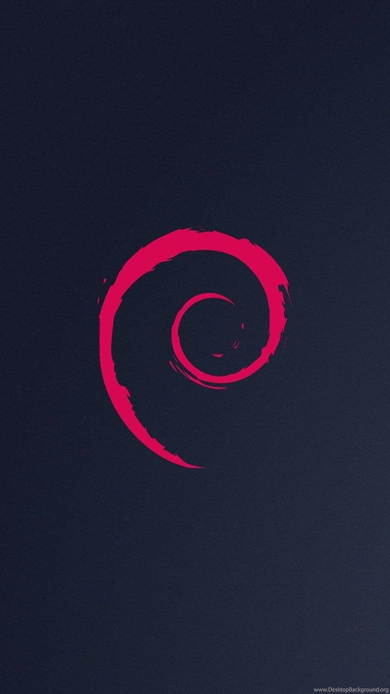

# Proyecto de Animación con HTML y CSS

Este es un pequeño proyecto en el que he trabajado para crear un efecto visual atractivo usando solo HTML y CSS. La idea es que cuando pases el ratón sobre una imagen, esta cambie de perspectiva y revele otra imagen con una transición suave.

## Tecnologías Utilizadas

- **HTML**: Para la estructura de la página.
- **CSS**: Para los estilos y las animaciones.

## ¿Cómo funciona?

1. He colocado dos imágenes dentro de un `<article>`.
2. La primera imagen (de fondo) tiene sombras y bordes redondeados para un efecto más estético.
3. La segunda imagen (Tux) está oculta inicialmente con `opacity: 0` y posicionada de manera absoluta.
4. Cuando pasas el ratón sobre el artículo:
   - Se aplica una transformación en perspectiva y rotación.
   - La imagen de Tux aparece con una transición suave.
   - El fondo se oscurece gradualmente con un degradado.

## Archivos

### `index.html`
Aquí defino la estructura básica con un `<article>` que contiene dos imágenes.

```html
<article>
    
    
</article>
```

### `style.css`
Aquí doy estilo y defino las animaciones:

```css
article:hover {
    transform:
        perspective(250px)
        rotateX(10deg)
        translateY(-5%)
        translateZ(0);
}

article:hover img:last-child {
    opacity: 1;
    transform: translateY(10%);
}
```

## ¿Cómo usarlo?
1. Clona el repositorio:
   ```bash
   git clone https://github.com/mi-usuario/mi-repositorio.git
   ```
2. Abre `index.html` en tu navegador.
